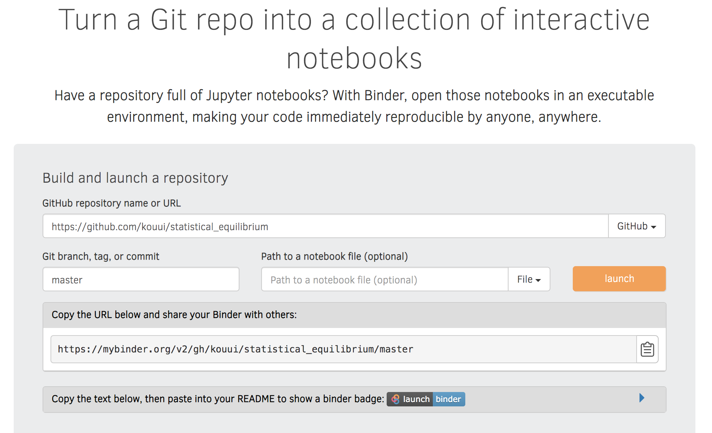
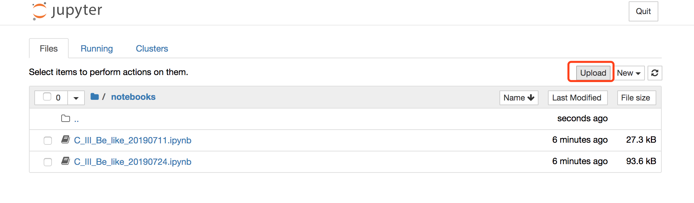

### Reproducing the result

if you only want to have a try and reproduce the simulation result in `*.ipynb` files instead of making some development, go to [https://gke.mybinder.org/](https://gke.mybinder.org/)

1. GitHub repository name or URL : https://github.com/kouui/statistical_equilibrium
2. Git branch, tag, or commit : master
3. click `launch` and wait ~1 minute before the Docker image being built.
4. move to ./notebooks/ folder, where notebook *.ipynb files are saved.
5. if you want to reproduce my result, just run *.ipynb files over there.
6. if you want to try your own *.ipynb file, just click `upload` to upload your file to the server.
7. at last, do not forget to `Save and Checkpoint` and then `Download As` `Notebook (.ipynb)` to your local storage.

