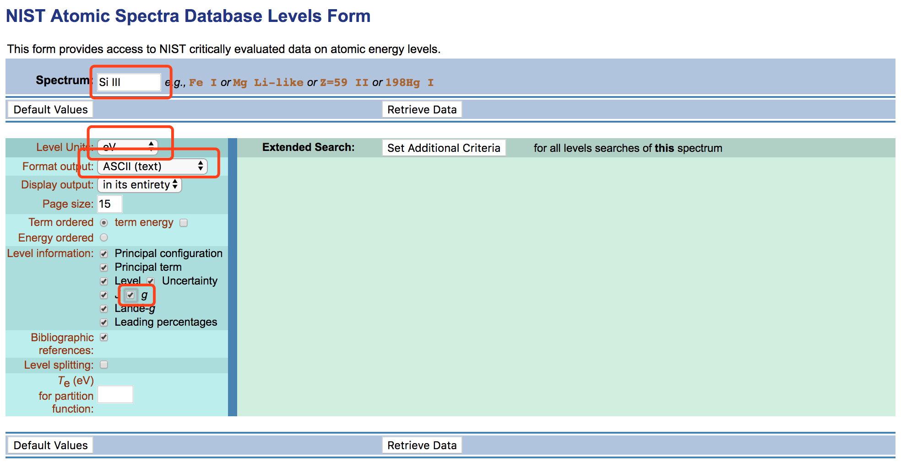
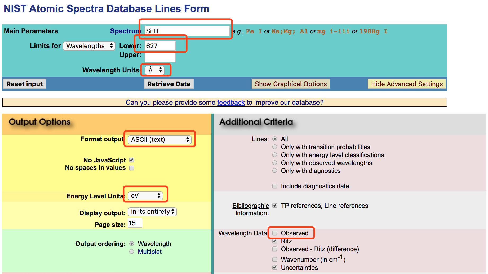
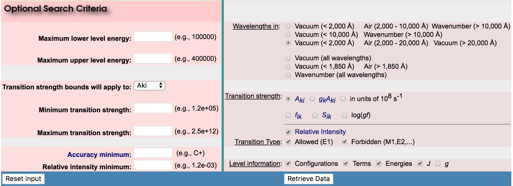

## Reproducing the result

if you only want to have a try and reproduce the simulation result in `*.ipynb` files instead of making some development, go to [https://gke.mybinder.org/](https://gke.mybinder.org/)

1. GitHub repository name or URL : https://github.com/kouui/spectra
2. Git branch, tag, or commit : master
3. click `launch` and wait ~1 minute before the Docker image being built.
4. move to ./notebooks/ folder, where notebook *.ipynb files are saved.
5. if you want to reproduce my result, just run *.ipynb files over there.
6. if you want to try your own *.ipynb file, just click `upload` to upload your file to the server.
7. at last, do not forget to `Save and Checkpoint` and then `Download As` `Notebook (.ipynb)` to your local storage.


|  |
|:---:|
| Fig 1. steps 1,2,3 |

|  |
|:---:|
| Fig 2. steps 4,5,6 |

|  |
|:---:|
| Fig 3. steps 7 |

---

## Generating format we need using NIST Level/Line information

First download NIST Level/Line information to `./atom/nist_ASCII/` folder.

take "Si III Mg like" atomic model for example:

1. open https://physics.nist.gov/PhysRefData/ASD/levels_form.html
2. modified the corresponding parameters in red rectangular shown in Fig 4.
3. copy the whole text to `./atom/nist_ASCII/Si_III_Mg_like/Si_III_Mg_like.Level`
4. open https://physics.nist.gov/PhysRefData/ASD/lines_form.html and click `show Adcanced Settings`
5. modified the corresponding parameters in red rectangular shown in Fig 5.
6. copy the whole text to `./atom/nist_ASCII/Si_III_Mg_like/Si_III_Mg_like.Line`
7. modify `terms` and `path` variables in python script `./tools/nist_to_level_line.py`, and then execute it
```
$ cd /Path_to/spectra/tools
$ python nist_to_level_line.py
```
8. step 7. will generate file `./atom/nist_ASCII/Si_III_Mg_like/Si_III_Mg_like.Result`
9. After all, copy the text in `./atom/nist_ASCII/Si_III_Mg_like/Si_III_Mg_like.Result` into `./atom/Si_III_Mg_like.txt`. Be aware of the format.

|  |
|:---:|
| Fig 4. |

|  |
|:---:|
|  |
| Fig 5. |

---

## TODO

- [X] debug newly added functions in commit [3607eef](https://github.com/kouui/spectra/commit/3607eeff005caae0c659a94344c873fde254e9e5) || finished in commit [852ef87](https://github.com/kouui/spectra/commit/852ef87b443dfcbffbdcd60cd9f2b6be1b3c7618)
- [ ] convert the (I,J) indexing of AJI and CE to Level indexing : (conf_term_J(lower), conf_term_J(upper)) (combine **spectra** and **AtomicQuery**)
- [ ] calculate the fitting parameters for collisional excitation/ionization. Because computation using fitting formula is always faster than interpolation, and it is also easier to optmize, e.x. `numba` and so on
- [ ] try to examine the proposed line pair in Solar-C_EUVST with our code
- [ ] add functions for calculating collisional ionization/recombination rate coeffcients.
- [ ] complete the radiative transition rates in calculating SE.
- [ ] bound-free, free-free opacity, and so on ...
