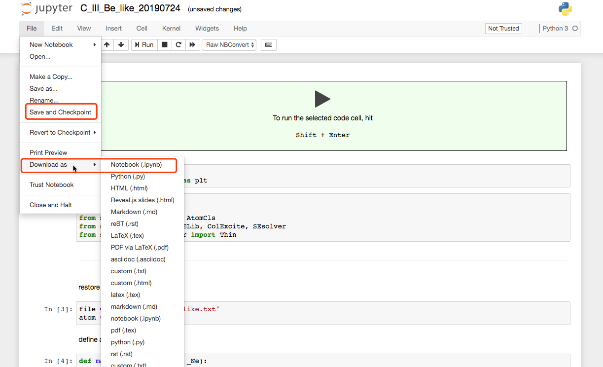
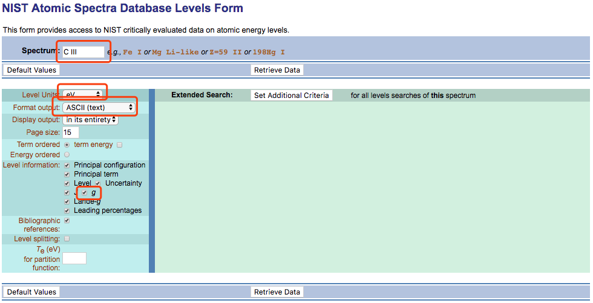
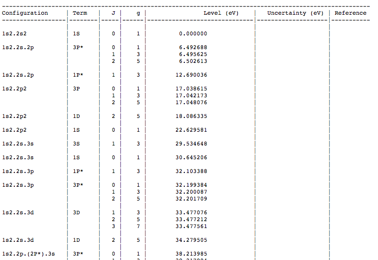
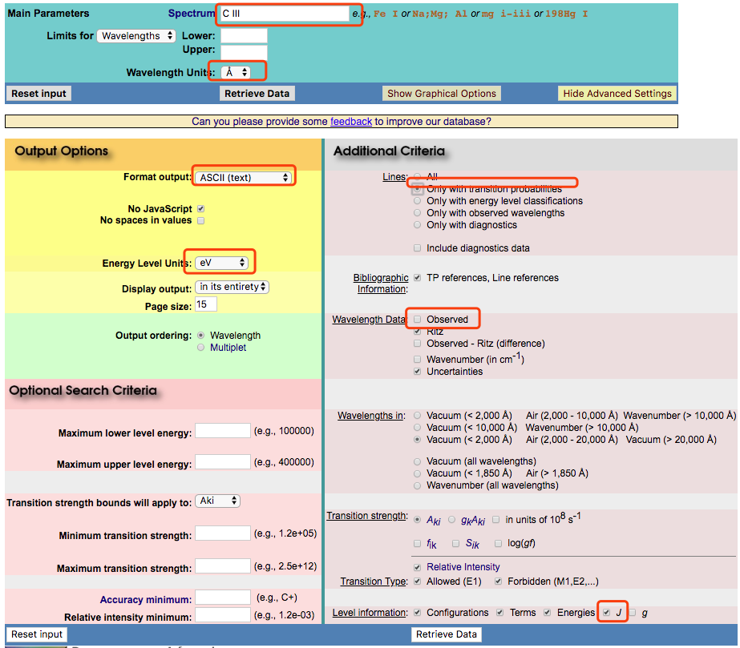
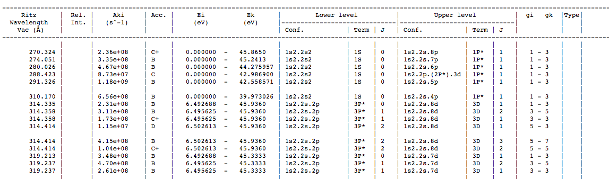
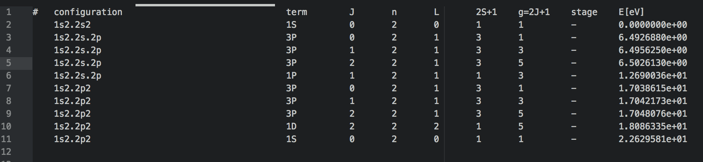
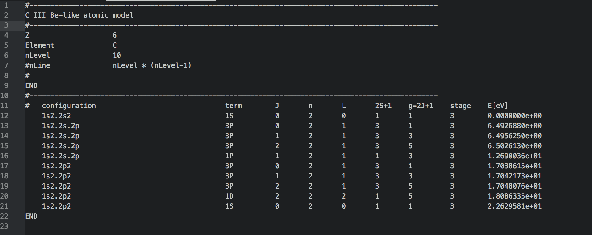
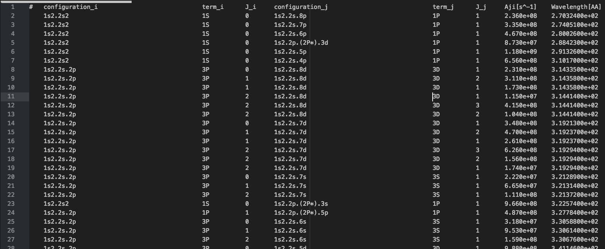
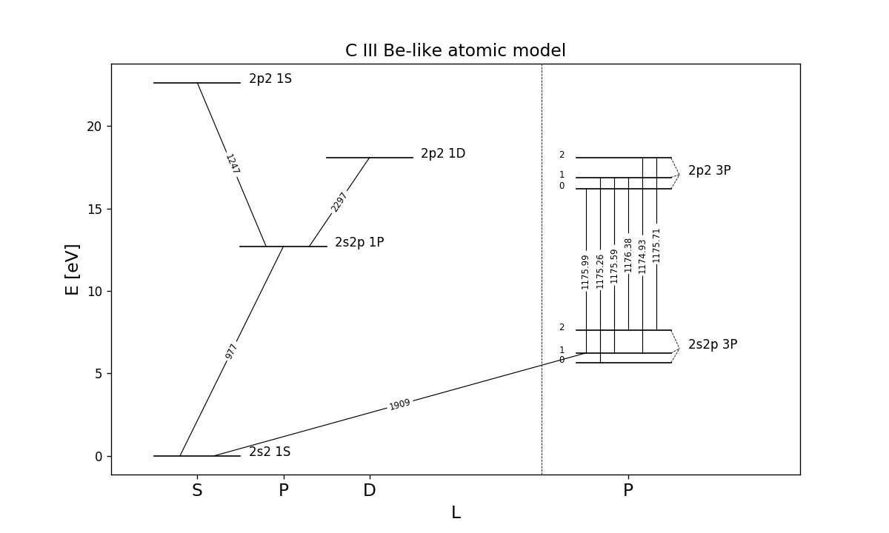

## Reproducing the result

if you only want to have a try and reproduce the simulation result in `*.ipynb` files instead of making some development, go to [https://gke.mybinder.org/](https://gke.mybinder.org/)

1. GitHub repository name or URL : https://github.com/kouui/spectra
2. Git branch, tag, or commit : master
3. click `launch` and wait ~ 2 minutes before the Docker image being built.
4. move to ./notebooks/ folder, where notebook *.ipynb files are saved.
5. if you want to reproduce my result, just run *.ipynb files over there.
6. if you want to try your own *.ipynb file, just click `upload` to upload your file to the server.
7. at last, do not forget to `Save and Checkpoint` and then `Download As` `Notebook (.ipynb)` to your local storage.


|  |
|:---:|
| Fig 1. steps 1,2,3 |

|  |
|:---:|
| Fig 2. steps 4,5,6 |

|  |
|:---:|
| Fig 3. steps 7 |

---

## Available Atomic model


| Atom & ionization stage | Available Terms | nLevel | Ref : Level & Aji | Ref: electron impact ECS | Ref: proton impact ECS |
|:-----------------------:|:----------------|:-----|:-----|:----------------|:-------------------------|
| C III | "1s2.2s2 1S" - "1s2.2p2 1S" | 10 | NIST | [Berrington et al. 1985](./ref/ECS/Berrington_et_al_1985.pdf) | not yet |
| O V | "1s2.2s2 1S" - "1s2.2p2 1S" | 10 | NIST | [Berrington et al. 1985](./ref/ECS/Berrington_et_al_1985.pdf) | not yet |
| Si III (not yet) | "1s2.2s2.2p6.3s2 1S"- "1s2.2s2.2p6.3d.4d 1S" | 141 | [Kanti 2017](./ref/ECS/Kanti_2017.pdf) | [Kanti 2017](./ref/ECS/Kanti_2017.pdf) | not yet |


## Formatting files in database

For instance, we need the information of C^{2+}.

### 1. Copy Level information and Einstein Aji coefficient from NIST database {: Developer}

Level :

1. open https://physics.nist.gov/PhysRefData/ASD/levels_form.html
2. modified the corresponding parameters in red rectangular shown in Fig 1.
3. The query format looks like Fig 2.
4. copy the whole text to `./atom/NIST_ASCII/C_III/C_III.NistLevel`

|  |
|:---:|
| Fig 1. |

|  |
|:---:|
| Fig 2. |

Einstein Aji :

1. open https://physics.nist.gov/PhysRefData/ASD/lines_form.html
2. modified the corresponding parameters in red rectangular shown in Fig 3.
3. The query format looks like Fig 4.
4. copy the whole text to `./atom/NIST_ASCII/C_III/C_III.NistLine`

|  |
|:---:|
| Fig 3. |

|  |
|:---:|
| Fig 4. |

### 2. Format Level data (Config) {: Developer}

in this case, information such as Aji is taken from NIST.

1. check whether we need a `_prefix` for the inner shell configuration.
> for example, in Fig 2., the ground level configuration is '2s2' instead of the full configuration '1s2.2s2', then we need to specify `_prefix="1s2."`
2. modify the parameter in `./tools/prepare_level_from_nist.py` and then execute it. This will output a prototype config file called `./atom/config/C_III.Level` looks like Fig 5.
3. modify `stage` column and add general information into `./atom/config/C_III.Level` (Fig 6.). Lines start with '#' is comment line.

|  |
|:---:|
| Fig 5. |

|  |
|:---:|
| Fig 6. |


### 3. Format Aji and Wavelength data (Database) {: Developer}

in this case, information such as Aji is taken from NIST.

1. check whether we need a `_prefix` for the inner shell configuration.
> for example, in Fig 2., the ground level configuration is '2s2' instead of the full configuration '1s2.2s2', then we need to specify `_prefix="1s2."`
2. modify the parameter in `./tools/prepare_Aji_from_nist.py` and then execute it. This will output a prototype config file called `./atom/C_III/Einstein_A/Nist.Aji` looks like Fig 7.
3. add more general information into `./atom/config/C_III.Level` as comment line such as "reference" and so on.

|  |
|:---:|
| Fig 7. |


### 4. Format Effective Collision Strength data for Collisional Excitation (database) {: Developer}

Since for different atom with different ionization stage the data comes from different paper/database/website, there is no definite script to format ECS (Effective Collision Strength) data.

However, like Aji, Effective Collision Strength table should also follow (configuration, term, J) indexing (ctj indexing), like Fig 8.

|  |
|:---:|
| Fig 8. |

---

### 5. Construct `Atom()` instances (User interface) {: User}

An `AtomCls.Atom()`` instance can be constructed by
```
import sys
sys.path.append("..")

from src.Structure import AtomCls
file = "../atom/config/C_III.Level"
file_Aji = "../atom/C_III/Einstein_A/Nist.Aji"                                    # optional
file_CEe = "../atom/C_III/Collisional_Excitation/Berrington_et_al_1985.Electron"  # optional
atom = AtomCls.Atom(file, _file_Aji=file_Aji, _file_CEe=file_CEe)
```

furthermore, `Aji` and `CE` data could be read without resetting *.Level config file, like
```
atom.read_Aji(_file_Aji=file_Aji)
atom.read_CE(_file_CEe=file_CEe)
```

the available properties of this Class contains
> `atom.Title`, `atom.Z`, `atom.Element`, `atom.nLevel`, `atom.nLine`, `atom.Level`, `atom.Level_info`, `atom.Level_info_table`, `atom.Line_idx_table`, `atom.Line_ctj_table`, `atom.Line`, `atom.CE_Te_table`, `atom.CE_table`, `atom.CE_coe`, `atom.CE_type`


### 6. Generate Grotrian diagram {: User}

`Grotrian.Grotrian()` to generate Grotrian diagram given a `AtomCls.Atom()` instance.
```
import sys
sys.path.append("..")

from src.Structure import AtomCls
from src.Visual import Grotrian

# construct AtomCls.Atom() instance
file = "../atom/config/C_III.Level"
file_Aji = "../atom/C_III/Einstein_A/Nist.Aji"
file_CEe = "../atom/C_III/Collisional_Excitation/Berrington_et_al_1985.Electron"
atom = AtomCls.Atom(file, _file_Aji=file_Aji, _file_CEe=file_CEe)

# construct Grotrian.Grotrian() instance
# _conf_prefix is the configuration prefix that you do not want to plot in grotrian diagram
gro = Grotrian.Grotrian(_atom=atom, _conf_prefix="1s2.")
gro.make_fig(_figsize=(10,6))

# this list defines the transition line you want to plot with between levels.
line_plot = (
    (0, 4, "977", 0.3, 0.5),
    (0, 2, "1909", 0.7, 0.1),
    (4, 9, "1247", 0.3, 0.5),
    (4, 8, "2297", 0.8, 0.5),
    (2, 5, "1175.99", 0.1, 0.1),
    (1, 6, "1175.26", 0.25, 0.25),
    (2, 6, "1175.59", 0.40, 0.40),
    (3, 6, "1176.38", 0.55, 0.55),
    (2, 7, "1174.93", 0.70, 0.70),
    (3, 7, "1175.71", 0.85, 0.85),
)
# plot the transition line listed above
for i, j, wl, _r1, _r2 in line_plot:
    _cfj1 = atom.Level_info_table[i]
    _cfj2 = atom.Level_info_table[j]
    gro.connect_line(_cfj1=_cfj1, _cfj2=_cfj2, _r1=_r1, _r2=_r2, _c="black", _text=wl, _tsize=7, _r=0.4)

gro.show_fig()
# if you want to save the figure
gro.save_fig("../fig/grotrian/" + file.split('/')[-1].replace(".Level",".png"))
```

the above code will generate the grotrian diagram following the C_III.Level configuration (Fig 9.).

|  |
|:---:|
| Fig 9. |

---
---

## Notes

for proton impact collision excitation

- [chianti database](http://www.chiantidatabase.org/chianti_download.html) provides fitting parameters of proton excitation Rate Coefficient and electron excitation Effective Collisional Strength. **All of the proton transitions are forbidden transitions taking place between levels within the same configuration (fine structure)**.

- [Copeland et al. 1997](./ref/ECS/Copeland_et_al_1997.pdf) listed a table of references for **Be-like to Cl-like ions for elements from C to Ni**. Also **fine_structure excitation only**.

---

## TODO

- [X] debug newly added functions in commit [3607eef](https://github.com/kouui/spectra/commit/3607eeff005caae0c659a94344c873fde254e9e5) || finished in commit [852ef87](https://github.com/kouui/spectra/commit/852ef87b443dfcbffbdcd60cd9f2b6be1b3c7618)
- [X] convert the (I,J) indexing of AJI and CE to Level indexing : (conf_term_J(lower), conf_term_J(upper)) (combine **spectra** and **AtomicQuery**) || finished in commit [5bca5a8](https://github.com/kouui/spectra/commit/5bca5a82ce6ee42260a10a69fcd13fc9630a99d9)
- [ ] calculate the fitting parameters for collisional excitation/ionization. Because computation using fitting formula is always faster than interpolation, and it is also easier to optmize, e.x. `numba` and so on
- [ ] try to examine the proposed line pair in Solar-C_EUVST with our code
- [ ] add functions for calculating collisional ionization/recombination rate coeffcients.
- [ ] complete the radiative transition rates in calculating SE.
- [ ] bound-free, free-free opacity, and so on ...
